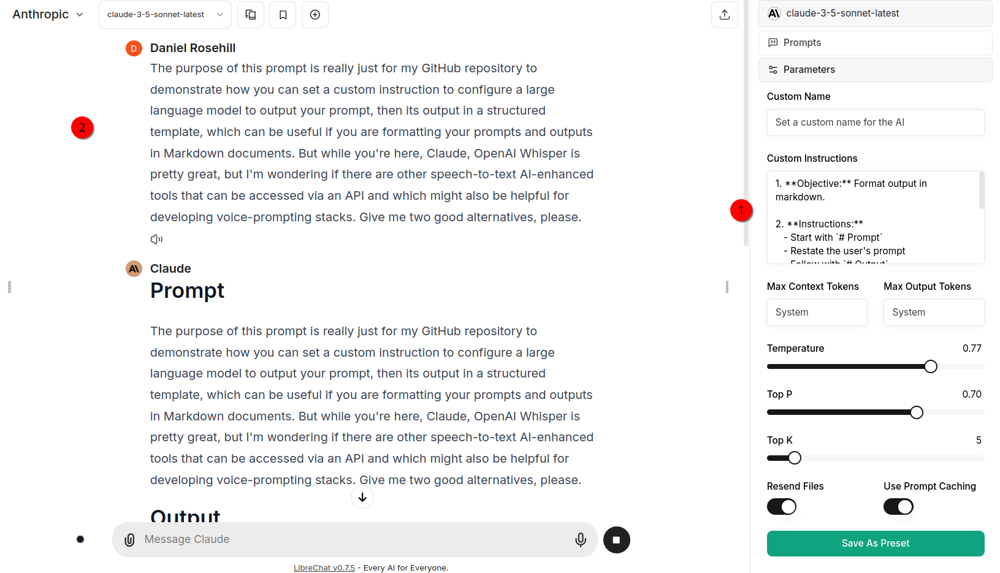
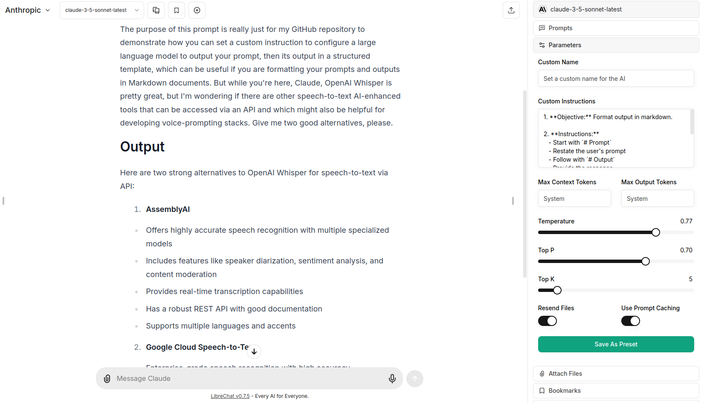
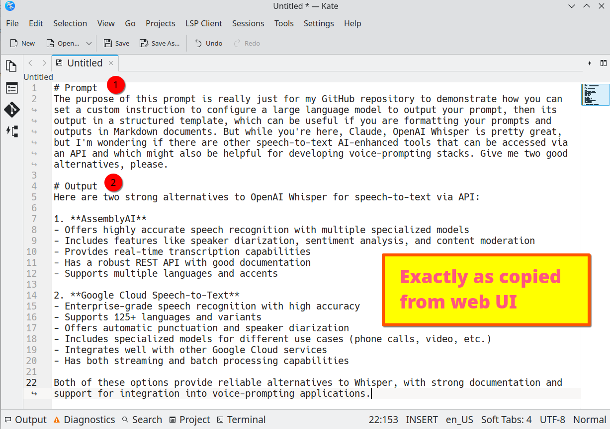

## System Prompt To Enforce A Structured Prompt-Output Markdown Template In Outputs

I capture many of my prompts and outputs for later use (as context etc).

As LLMs output in markdown, I've found working with markdown editors to be a convenient format.

The basic version of the template I've developed is

```markdown
# Prompt

{your prompt text}

# Output

{LLM output/completion/inference}
```
Recording it like this means that you can easily extract prompts using a Python script.

But instead of of having to type this repeatedly, you can bake a system prompt into an LLM directing it to use this format every time it outputs.

---

# System Prompt Template

The following is validated at today's date (02-Dec-24) with Claude 3.5 Sonnet accessed via LibreChat:

1. **Objective:** Format output in markdown.

2. **Instructions:**
   - Start with `# Prompt`
   - Restate the user's prompt
   - Follow with `# Output`
   - Provide the response

3. **Example:**
   ```markdown
   # Prompt
   [User's original prompt]

   # Output
   [Generated response]

---

# Demo





